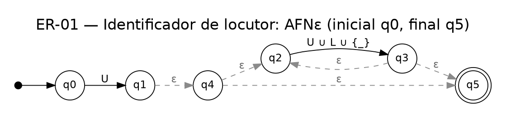
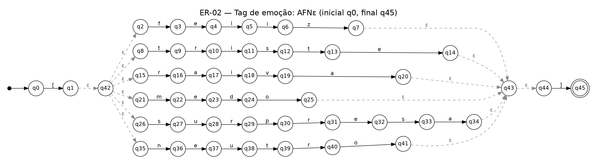
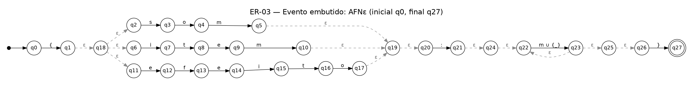
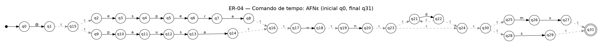
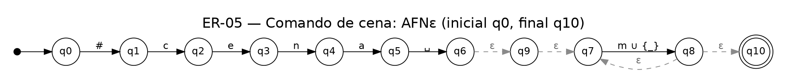
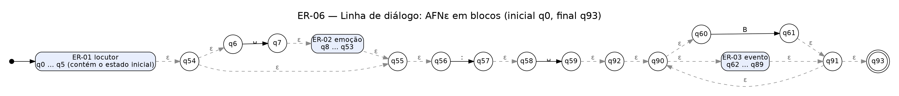

# Ficha das Expressões Regulares

> Gerado por `node automatos/gerar.js` a partir de `js/patterns.js`, `tests/cases.js`, `automatos/meta.js` e dos AFNε. Não edite à mão: altere a fonte e rode o gerador; depois `node automatos/verificar.js`.

## Convenções

**Notação formal** (a do guia de sintaxe): união `r | s`; concatenação por justaposição; fecho de Kleene `r*`; fecho positivo `r+ = r r*`; opcionalidade `r? = ( r | ε )`; `ε` é a palavra vazia; parênteses agrupam. Símbolos literais vêm entre aspas simples (`'['`, `':'`) e `'abc'` abrevia a concatenação `a b c`. `␣` é o espaço.

**Abreviações** (cada uma é só uma união finita de símbolos):

- U = A | B | C | D | E | F | G | H | I | J | K | L | M | N | O | P | Q | R | S | T | U | V | W | X | Y | Z | Á | À | Â | Ã | É | Ê | Í | Ó | Ô | Õ | Ú | Ç  (maiúsculas)
- L = a | b | c | d | e | f | g | h | i | j | k | l | m | n | o | p | q | r | s | t | u | v | w | x | y | z | á | à | â | ã | é | ê | í | ó | ô | õ | ú | ü | ç  (minúsculas)
- m = a | b | … | z  (minúsculas ASCII);  d = 0 | 1 | … | 9;  n = 1 | 2 | … | 9
- B = Σ_corpo (enumerado no Apêndice A): ASCII imprimível (espaço … `~`), letras acentuadas do português e `– — ‘ ’ “ ” …`, **sem** `{ } [ ]`.

**Como o código usa os padrões** (`js/patterns.js`, função `make`):

```js
function make(name, src) {
  return {
    name, src,
    full: new RegExp('^(?:' + src + ')$'),
    scan: () => new RegExp(src, 'g'),
  };
}
```

- `full` exige que a cadeia inteira case. As âncoras `^` e `$` e o grupo `(?:…)` não são símbolos do alfabeto; o `(?:…)` é só agrupamento (não é lookaround).
- `scan` é o mesmo padrão, sem âncoras e com a flag `g`. O parser o usa apenas para localizar eventos dentro de uma fala que já passou por `full` (ER-03); não é um reconhecimento de linguagem.
- O parser e a interface não definem nenhuma regex própria: `automatos/verificar.js` confere isso.
- Os padrões não usam retroreferências, recursão, condicionais, lookaround, `.`, `\d`, `\s` nem `\w` (também conferido por `verificar.js`).

**Escopo do alfabeto.** O AFNε precisa de alfabeto finito (JFLAP), então a classe negada `[^{}\[\]]` do código é tomada sobre Σ_corpo. Símbolos fora dele (emoji, tabulação, quebra de linha) o código aceita no corpo da fala, mas não fazem parte da linguagem formal; ver "Resultado e limite" da ER-06.

**Pré-processamento do parser** (fora das ER): cada linha passa por `trim()` antes da análise; indentação, espaços finais e `\r` (CRLF) são ignorados.

**No JFLAP**, os `.jff` usam `␣` no lugar do espaço: ao simular, digite `␣` onde haveria espaço (ex.: `Aria:␣Olá`).

## Quadro-resumo

| ID | Nome | ER formal |
|---|---|---|
| ER-01 | Identificador de locutor | `U ( U \| L \| _ )*` |
| ER-02 | Tag de emoção | `'[' ( feliz \| triste \| raiva \| medo \| surpresa \| neutro ) ']'` |
| ER-03 | Evento embutido | `'{' ( som \| item \| efeito ) ':' ( m \| _ )+ '}'` |
| ER-04 | Comando de tempo | `'@' ( espera \| pausa ) ␣ n d* ( ms \| s )` |
| ER-05 | Comando de cena | `'#cena' ␣ ( m \| _ )+` |
| ER-06 | Linha de diálogo completa | `S ( ␣ E )? ':' ␣ ( B \| V )+` |

## ER-01 — Identificador de locutor

**Identificação e função no programa:** ER-01, Identificador de locutor. Valida o nome de quem fala (ex.: Aria, Mago_Negro, João). Compõe a ER-06; o parser também a aplica isoladamente ao nome para dizer se o erro está no locutor.

**Alfabeto (Σ):** Σ = U ∪ L ∪ {_}  (U e L definidos nas convenções).

**Linguagem L:** Cadeias que começam com uma letra maiúscula (U) seguida de zero ou mais símbolos de U, L ou "_". Não aceita a cadeia vazia, espaço, dígito, pontuação nem inicial minúscula.

**ER formal:** `U ( U | L | _ )*`

**Sintaxe implementada** (copiada de `js/patterns.js`):

```js
const speakerSrc = String.raw`[A-ZÁÀÂÃÉÊÍÓÔÕÚÇ][A-Za-zÁÀÂÃÉÊÍÓÔÕÚÇáàâãéêíóôõúüç_]*`;
```

Padrão efetivo usado por `full`, com as âncoras:

```text
^(?:[A-ZÁÀÂÃÉÊÍÓÔÕÚÇ][A-Za-zÁÀÂÃÉÊÍÓÔÕÚÇáàâãéêíóôõúüç_]*)$
```

**Equivalência e operadores utilizados** (atalhos do código × operadores formais):

| Sintaxe no código | Significado | Forma formal |
|---|---|---|
| `[A-ZÁÀÂÃÉÊÍÓÔÕÚÇ]` | classe finita (primeiro símbolo) | `U` |
| `[A-Za-zÁÀÂÃÉÊÍÓÔÕÚÇáàâãéêíóôõúüç_]` | classe finita (demais símbolos) | `( U \| L \| _ )` |
| `*` | fecho de Kleene: zero ou mais (inclui ε) | `*` |
| `(justaposição)` | concatenação | `(justaposição)` |
| `^(?:…)$  (aplicado por make)` | âncoras + grupo: a cadeia inteira deve casar; não são símbolos do alfabeto | `(não aparece na ER formal)` |

**AFNε** (Thompson): estado inicial q0; estado final q5; 6 estados; 121 transições, das quais 5 são movimentos vazios (ε). Arquivos: `automatos/afne_speaker.jff` (JFLAP) e `automatos/afne_speaker.md`.


(vetorial: `diagramas/afne_speaker.svg`)

Legenda: seta vinda de um ponto = estado inicial; círculo duplo = estado final; linha tracejada cinza = movimento ε; U, L, m, d, n, B = classes das convenções; ␣ = espaço.

| De | Símbolo | Para |
|---|---|---|
| q0 | U | q1 |
| q1 | ε | q4 |
| q2 | U ∪ L ∪ {_} | q3 |
| q3 | ε | q2 |
| q3 | ε | q5 |
| q4 | ε | q2 |
| q4 | ε | q5 |

**Testes** (7 aceitas e 7 rejeitadas; mínimo da lauda: 6 e 6; cada ER tem ao menos um caso-limite):

| Cadeia | Esperado | Regex | AFNε | Obs. |
|---|---|---|---|---|
| `"Aria"` | aceita | aceita | aceita |  |
| `"Kael"` | aceita | aceita | aceita |  |
| `"Mago_Negro"` | aceita | aceita | aceita |  |
| `"João"` | aceita | aceita | aceita |  |
| `"Inês"` | aceita | aceita | aceita |  |
| `"Ângelo"` | aceita | aceita | aceita |  |
| `"A"` | aceita | aceita | aceita | **caso-limite** |
| `"aria"` | rejeita | rejeita | rejeita |  |
| `"1Aria"` | rejeita | rejeita | rejeita |  |
| `"Mago Negro"` | rejeita | rejeita | rejeita |  |
| `"Zoë"` | rejeita | rejeita | rejeita |  |
| `"Aria!"` | rejeita | rejeita | rejeita |  |
| `"ângelo"` | rejeita | rejeita | rejeita |  |
| `""` | rejeita | rejeita | rejeita | **caso-limite** |

**Resultado e limite.** Comportamento observado: todos os testes acima dão o resultado esperado na Regex do código e no AFNε. Limitações e possíveis falsos resultados:

- Rejeita por desenho nomes plausíveis em RPG (falsos negativos): com hífen, apóstrofo, dígito ou letra fora de U e L. Nomes compostos devem usar "_".
- Falso positivo não observado nos testes nem nas cadeias aleatórias de verificar.js: toda cadeia aceita começa com maiúscula e só tem símbolos de U, L ou "_".

Cadeias-limite observadas (comportamento real, calculado na geração desta ficha):

| Cadeia | Regex | AFNε | Por que é um limite |
|---|---|---|---|
| `"D'Artagnan"` | rejeita | rejeita | apóstrofo |
| `"Ana-Maria"` | rejeita | rejeita | hífen |
| `"Guarda2"` | rejeita | rejeita | dígito |
| `"Zoë"` | rejeita | rejeita | 'ë' não pertence a L |
| `"Mago Negro"` | rejeita | rejeita | espaço (use Mago_Negro) |

## ER-02 — Tag de emoção

**Identificação e função no programa:** ER-02, Tag de emoção. Valida a emoção entre colchetes que acompanha o locutor (ex.: [feliz]). Compõe a ER-06; o parser também a aplica isoladamente à tag para dizer se o erro está na emoção.

**Alfabeto (Σ):** Σ = m ∪ {'[', ']'}  (m = letras minúsculas a–z).

**Linguagem L:** Exatamente uma das seis palavras feliz, triste, raiva, medo, surpresa ou neutro, entre colchetes. Diferencia maiúsculas de minúsculas; não aceita colchetes desbalanceados, espaços internos nem duas tags.

**ER formal:** `'[' ( feliz | triste | raiva | medo | surpresa | neutro ) ']'`

**Sintaxe implementada** (copiada de `js/patterns.js`):

```js
const emotionSrc = String.raw`\[(feliz|triste|raiva|medo|surpresa|neutro)\]`;
```

Padrão efetivo usado por `full`, com as âncoras:

```text
^(?:\[(feliz|triste|raiva|medo|surpresa|neutro)\])$
```

**Equivalência e operadores utilizados** (atalhos do código × operadores formais):

| Sintaxe no código | Significado | Forma formal |
|---|---|---|
| `\[  e  \]` | escape: colchetes literais (sem a barra seriam uma classe de caracteres) | `'['  e  ']'` |
| `(feliz\|triste\|raiva\|medo\|surpresa\|neutro)` | agrupamento + alternância; a captura não altera a linguagem | `( feliz \| triste \| raiva \| medo \| surpresa \| neutro )` |
| `(justaposição)` | concatenação dos símbolos de cada palavra | `f e l i z, t r i s t e, …` |
| `^(?:…)$  (aplicado por make)` | âncoras + grupo: a cadeia inteira deve casar; não são símbolos do alfabeto | `(não aparece na ER formal)` |

**AFNε** (Thompson): estado inicial q0; estado final q45; 46 estados; 50 transições, das quais 14 são movimentos vazios (ε). Arquivos: `automatos/afne_emotion.jff` (JFLAP) e `automatos/afne_emotion.md`.


(vetorial: `diagramas/afne_emotion.svg`)

Legenda: seta vinda de um ponto = estado inicial; círculo duplo = estado final; linha tracejada cinza = movimento ε; U, L, m, d, n, B = classes das convenções; ␣ = espaço.

| De | Símbolo | Para |
|---|---|---|
| q0 | [ | q1 |
| q1 | ε | q42 |
| q2 | f | q3 |
| q3 | e | q4 |
| q4 | l | q5 |
| q5 | i | q6 |
| q6 | z | q7 |
| q7 | ε | q43 |
| q8 | t | q9 |
| q9 | r | q10 |
| q10 | i | q11 |
| q11 | s | q12 |
| q12 | t | q13 |
| q13 | e | q14 |
| q14 | ε | q43 |
| q15 | r | q16 |
| q16 | a | q17 |
| q17 | i | q18 |
| q18 | v | q19 |
| q19 | a | q20 |
| q20 | ε | q43 |
| q21 | m | q22 |
| q22 | e | q23 |
| q23 | d | q24 |
| q24 | o | q25 |
| q25 | ε | q43 |
| q26 | s | q27 |
| q27 | u | q28 |
| q28 | r | q29 |
| q29 | p | q30 |
| q30 | r | q31 |
| q31 | e | q32 |
| q32 | s | q33 |
| q33 | a | q34 |
| q34 | ε | q43 |
| q35 | n | q36 |
| q36 | e | q37 |
| q37 | u | q38 |
| q38 | t | q39 |
| q39 | r | q40 |
| q40 | o | q41 |
| q41 | ε | q43 |
| q42 | ε | q2 |
| q42 | ε | q8 |
| q42 | ε | q15 |
| q42 | ε | q21 |
| q42 | ε | q26 |
| q42 | ε | q35 |
| q43 | ε | q44 |
| q44 | ] | q45 |

**Testes** (6 aceitas e 6 rejeitadas; mínimo da lauda: 6 e 6; cada ER tem ao menos um caso-limite):

| Cadeia | Esperado | Regex | AFNε | Obs. |
|---|---|---|---|---|
| `"[feliz]"` | aceita | aceita | aceita |  |
| `"[triste]"` | aceita | aceita | aceita |  |
| `"[raiva]"` | aceita | aceita | aceita |  |
| `"[medo]"` | aceita | aceita | aceita |  |
| `"[surpresa]"` | aceita | aceita | aceita |  |
| `"[neutro]"` | aceita | aceita | aceita | **caso-limite** |
| `"[alegre]"` | rejeita | rejeita | rejeita |  |
| `"feliz"` | rejeita | rejeita | rejeita |  |
| `"[feliz"` | rejeita | rejeita | rejeita |  |
| `"[Feliz]"` | rejeita | rejeita | rejeita |  |
| `"[feliz][medo]"` | rejeita | rejeita | rejeita |  |
| `"[]"` | rejeita | rejeita | rejeita | **caso-limite** |

**Resultado e limite.** Comportamento observado: todos os testes acima dão o resultado esperado na Regex do código e no AFNε. Limitações e possíveis falsos resultados:

- Só as seis emoções, com minúsculas; incluir uma nova emoção exige alterar a ER, o AFNε, os testes e a ficha.
- Falso positivo não observado nos testes nem nas cadeias aleatórias de verificar.js.

Cadeias-limite observadas (comportamento real, calculado na geração desta ficha):

| Cadeia | Regex | AFNε | Por que é um limite |
|---|---|---|---|
| `"[Feliz]"` | rejeita | rejeita | maiúscula |
| `"[ feliz ]"` | rejeita | rejeita | espaços dentro dos colchetes |
| `"[alegre]"` | rejeita | rejeita | fora das seis emoções |

## ER-03 — Evento embutido

**Identificação e função no programa:** ER-03, Evento embutido. Valida eventos sonoros, visuais ou de item inseridos na fala (ex.: {som:sino}). Compõe a ER-06; o parser usa a variante scan (sem âncoras, flag g) para localizar os eventos dentro de uma fala já validada.

**Alfabeto (Σ):** Σ = m ∪ {_, ':', '{', '}'}.

**Linguagem L:** Chave de abertura, um tipo (som, item ou efeito), dois pontos, um nome com uma ou mais letras minúsculas a–z ou "_", e chave de fechamento. Nome vazio, maiúsculas e tipos desconhecidos são rejeitados.

**ER formal:** `'{' ( som | item | efeito ) ':' ( m | _ )+ '}'`

**Sintaxe implementada** (copiada de `js/patterns.js`):

```js
const eventSrc   = String.raw`\{(som|item|efeito):([a-z_]+)\}`;
```

Padrão efetivo usado por `full`, com as âncoras:

```text
^(?:\{(som|item|efeito):([a-z_]+)\})$
```

**Equivalência e operadores utilizados** (atalhos do código × operadores formais):

| Sintaxe no código | Significado | Forma formal |
|---|---|---|
| `\{  e  \}` | escape: chaves literais (uma chave sem escape poderia ser lida como quantificador) | `'{'  e  '}'` |
| `(som\|item\|efeito)` | agrupamento + alternância; a captura não altera a linguagem | `( som \| item \| efeito )` |
| `:` | símbolo literal | `':'` |
| `([a-z_]+)` | classe finita + fecho positivo: r+ = r r* | `( m \| _ )+  ≡  ( m \| _ )( m \| _ )*` |
| `^(?:…)$  (aplicado por make)` | âncoras + grupo: a cadeia inteira deve casar; não são símbolos do alfabeto | `(não aparece na ER formal)` |

**AFNε** (Thompson): estado inicial q0; estado final q27; 28 estados; 56 transições, das quais 13 são movimentos vazios (ε). Arquivos: `automatos/afne_event.jff` (JFLAP) e `automatos/afne_event.md`.


(vetorial: `diagramas/afne_event.svg`)

Legenda: seta vinda de um ponto = estado inicial; círculo duplo = estado final; linha tracejada cinza = movimento ε; U, L, m, d, n, B = classes das convenções; ␣ = espaço.

| De | Símbolo | Para |
|---|---|---|
| q0 | { | q1 |
| q1 | ε | q18 |
| q2 | s | q3 |
| q3 | o | q4 |
| q4 | m | q5 |
| q5 | ε | q19 |
| q6 | i | q7 |
| q7 | t | q8 |
| q8 | e | q9 |
| q9 | m | q10 |
| q10 | ε | q19 |
| q11 | e | q12 |
| q12 | f | q13 |
| q13 | e | q14 |
| q14 | i | q15 |
| q15 | t | q16 |
| q16 | o | q17 |
| q17 | ε | q19 |
| q18 | ε | q2 |
| q18 | ε | q6 |
| q18 | ε | q11 |
| q19 | ε | q20 |
| q20 | : | q21 |
| q21 | ε | q24 |
| q22 | m ∪ {_} | q23 |
| q23 | ε | q22 |
| q23 | ε | q25 |
| q24 | ε | q22 |
| q25 | ε | q26 |
| q26 | } | q27 |

**Testes** (6 aceitas e 6 rejeitadas; mínimo da lauda: 6 e 6; cada ER tem ao menos um caso-limite):

| Cadeia | Esperado | Regex | AFNε | Obs. |
|---|---|---|---|---|
| `"{som:sino}"` | aceita | aceita | aceita |  |
| `"{item:chave_de_ferro}"` | aceita | aceita | aceita |  |
| `"{efeito:tremor}"` | aceita | aceita | aceita |  |
| `"{item:espada}"` | aceita | aceita | aceita |  |
| `"{efeito:x_y}"` | aceita | aceita | aceita |  |
| `"{som:a}"` | aceita | aceita | aceita | **caso-limite** |
| `"{musica:x}"` | rejeita | rejeita | rejeita |  |
| `"{som:Sino}"` | rejeita | rejeita | rejeita |  |
| `"{som sino}"` | rejeita | rejeita | rejeita |  |
| `"som:sino"` | rejeita | rejeita | rejeita |  |
| `"{som:sino}{item:x}"` | rejeita | rejeita | rejeita |  |
| `"{som:}"` | rejeita | rejeita | rejeita | **caso-limite** |

**Resultado e limite.** Comportamento observado: todos os testes acima dão o resultado esperado na Regex do código e no AFNε. Limitações e possíveis falsos resultados:

- Nomes só com a–z e "_": identificadores com dígito, hífen ou maiúscula são rejeitados por desenho (falsos negativos).
- Falso positivo não observado nos testes nem nas cadeias aleatórias de verificar.js.

Cadeias-limite observadas (comportamento real, calculado na geração desta ficha):

| Cadeia | Regex | AFNε | Por que é um limite |
|---|---|---|---|
| `"{item:chave2}"` | rejeita | rejeita | dígito |
| `"{som:Sino}"` | rejeita | rejeita | maiúscula |
| `"{item:chave-de-ferro}"` | rejeita | rejeita | hífen |

## ER-04 — Comando de tempo

**Identificação e função no programa:** ER-04, Comando de tempo. Valida pausas do roteiro (ex.: @espera 2s, @pausa 500ms). Uma linha aceita vira o comando wait, com a duração em milissegundos.

**Alfabeto (Σ):** Σ = m ∪ d ∪ {'@', ␣}.

**Linguagem L:** Arroba, espera ou pausa, um espaço, um inteiro positivo sem zero à esquerda (primeiro dígito 1–9, depois zero ou mais dígitos) e a unidade ms ou s. Rejeita 0s, 05s, número ou unidade ausentes e espaço duplo.

**ER formal:** `'@' ( espera | pausa ) ␣ n d* ( ms | s )`

**Sintaxe implementada** (copiada de `js/patterns.js`):

```js
const timeSrc    = String.raw`@(espera|pausa) ([1-9][0-9]*)(ms|s)`;
```

Padrão efetivo usado por `full`, com as âncoras:

```text
^(?:@(espera|pausa) ([1-9][0-9]*)(ms|s))$
```

**Equivalência e operadores utilizados** (atalhos do código × operadores formais):

| Sintaxe no código | Significado | Forma formal |
|---|---|---|
| `@` | símbolo literal | `'@'` |
| `(espera\|pausa)` | agrupamento + alternância | `( espera \| pausa )` |
| `(espaço)` | símbolo literal | `␣` |
| `[1-9]` | intervalo finito | `n = ( 1 \| 2 \| … \| 9 )` |
| `[0-9]*` | intervalo finito + fecho de Kleene | `d*  com  d = ( 0 \| 1 \| … \| 9 )` |
| `(ms\|s)` | agrupamento + alternância | `( ms \| s )` |
| `^(?:…)$  (aplicado por make)` | âncoras + grupo: a cadeia inteira deve casar; não são símbolos do alfabeto | `(não aparece na ER formal)` |

**AFNε** (Thompson): estado inicial q0; estado final q31; 32 estados; 52 transições, das quais 17 são movimentos vazios (ε). Arquivos: `automatos/afne_time.jff` (JFLAP) e `automatos/afne_time.md`.


(vetorial: `diagramas/afne_time.svg`)

Legenda: seta vinda de um ponto = estado inicial; círculo duplo = estado final; linha tracejada cinza = movimento ε; U, L, m, d, n, B = classes das convenções; ␣ = espaço.

| De | Símbolo | Para |
|---|---|---|
| q0 | @ | q1 |
| q1 | ε | q15 |
| q2 | e | q3 |
| q3 | s | q4 |
| q4 | p | q5 |
| q5 | e | q6 |
| q6 | r | q7 |
| q7 | a | q8 |
| q8 | ε | q16 |
| q9 | p | q10 |
| q10 | a | q11 |
| q11 | u | q12 |
| q12 | s | q13 |
| q13 | a | q14 |
| q14 | ε | q16 |
| q15 | ε | q2 |
| q15 | ε | q9 |
| q16 | ε | q17 |
| q17 | ␣ | q18 |
| q18 | ε | q19 |
| q19 | n | q20 |
| q20 | ε | q23 |
| q21 | d | q22 |
| q22 | ε | q21 |
| q22 | ε | q24 |
| q23 | ε | q21 |
| q23 | ε | q24 |
| q24 | ε | q30 |
| q25 | m | q26 |
| q26 | s | q27 |
| q27 | ε | q31 |
| q28 | s | q29 |
| q29 | ε | q31 |
| q30 | ε | q25 |
| q30 | ε | q28 |

**Testes** (6 aceitas e 6 rejeitadas; mínimo da lauda: 6 e 6; cada ER tem ao menos um caso-limite):

| Cadeia | Esperado | Regex | AFNε | Obs. |
|---|---|---|---|---|
| `"@espera 1s"` | aceita | aceita | aceita |  |
| `"@pausa 500ms"` | aceita | aceita | aceita |  |
| `"@espera 10s"` | aceita | aceita | aceita |  |
| `"@espera 120s"` | aceita | aceita | aceita |  |
| `"@pausa 9s"` | aceita | aceita | aceita |  |
| `"@pausa 1ms"` | aceita | aceita | aceita | **caso-limite** |
| `"@espera 05s"` | rejeita | rejeita | rejeita |  |
| `"@espera s"` | rejeita | rejeita | rejeita |  |
| `"@espera 2"` | rejeita | rejeita | rejeita |  |
| `"@esperar 2s"` | rejeita | rejeita | rejeita |  |
| `"@espera  2s"` | rejeita | rejeita | rejeita |  |
| `"@espera 0s"` | rejeita | rejeita | rejeita | **caso-limite** |

**Resultado e limite.** Comportamento observado: todos os testes acima dão o resultado esperado na Regex do código e no AFNε. Limitações e possíveis falsos resultados:

- Só inteiros positivos em ms ou s; sem decimais nem outras unidades (falsos negativos por desenho).
- Sem limite superior: a ER aceita, por exemplo, @espera 3000000s (3.000.000.000 ms), valor acima do máximo de 2.147.483.647 ms do setTimeout; pelo que se conhece dos navegadores, nesse caso a espera costuma terminar imediatamente (não verificado em navegador). É um limite da execução, não da linguagem reconhecida.

Cadeias-limite observadas (comportamento real, calculado na geração desta ficha):

| Cadeia | Regex | AFNε | Por que é um limite |
|---|---|---|---|
| `"@espera 1.5s"` | rejeita | rejeita | decimal |
| `"@espera 1min"` | rejeita | rejeita | unidade não prevista |
| `"@espera 3000000s"` | aceita | aceita | sem limite superior |

## ER-05 — Comando de cena

**Identificação e função no programa:** ER-05, Comando de cena. Valida a troca de cena (ex.: #cena taverna_antiga). Uma linha aceita vira o comando scene, que atualiza o título da cena.

**Alfabeto (Σ):** Σ = m ∪ {'#', _, ␣}.

**Linguagem L:** A cadeia #cena, um espaço e um nome com uma ou mais letras minúsculas a–z ou "_". Rejeita maiúsculas, espaços no nome, dígitos, acentos e nome ausente.

**ER formal:** `'#cena' ␣ ( m | _ )+`

**Sintaxe implementada** (copiada de `js/patterns.js`):

```js
const sceneSrc   = String.raw`#cena ([a-z_]+)`;
```

Padrão efetivo usado por `full`, com as âncoras:

```text
^(?:#cena ([a-z_]+))$
```

**Equivalência e operadores utilizados** (atalhos do código × operadores formais):

| Sintaxe no código | Significado | Forma formal |
|---|---|---|
| `#cena ` | sequência de símbolos literais (a notação 'abc' = a b c), incluindo um espaço | `'#cena' ␣` |
| `([a-z_]+)` | classe finita + fecho positivo: r+ = r r* | `( m \| _ )+  ≡  ( m \| _ )( m \| _ )*` |
| `^(?:…)$  (aplicado por make)` | âncoras + grupo: a cadeia inteira deve casar; não são símbolos do alfabeto | `(não aparece na ER formal)` |

**AFNε** (Thompson): estado inicial q0; estado final q10; 11 estados; 37 transições, das quais 4 são movimentos vazios (ε). Arquivos: `automatos/afne_scene.jff` (JFLAP) e `automatos/afne_scene.md`.


(vetorial: `diagramas/afne_scene.svg`)

Legenda: seta vinda de um ponto = estado inicial; círculo duplo = estado final; linha tracejada cinza = movimento ε; U, L, m, d, n, B = classes das convenções; ␣ = espaço.

| De | Símbolo | Para |
|---|---|---|
| q0 | # | q1 |
| q1 | c | q2 |
| q2 | e | q3 |
| q3 | n | q4 |
| q4 | a | q5 |
| q5 | ␣ | q6 |
| q6 | ε | q9 |
| q7 | m ∪ {_} | q8 |
| q8 | ε | q7 |
| q8 | ε | q10 |
| q9 | ε | q7 |

**Testes** (6 aceitas e 6 rejeitadas; mínimo da lauda: 6 e 6; cada ER tem ao menos um caso-limite):

| Cadeia | Esperado | Regex | AFNε | Obs. |
|---|---|---|---|---|
| `"#cena taverna"` | aceita | aceita | aceita |  |
| `"#cena floresta_sombria"` | aceita | aceita | aceita |  |
| `"#cena praia"` | aceita | aceita | aceita |  |
| `"#cena x_y"` | aceita | aceita | aceita |  |
| `"#cena castelo"` | aceita | aceita | aceita |  |
| `"#cena a"` | aceita | aceita | aceita | **caso-limite** |
| `"#cena Taverna"` | rejeita | rejeita | rejeita |  |
| `"#cena taverna antiga"` | rejeita | rejeita | rejeita |  |
| `"#Cena taverna"` | rejeita | rejeita | rejeita |  |
| `"cena taverna"` | rejeita | rejeita | rejeita |  |
| `"#cena castelo1"` | rejeita | rejeita | rejeita |  |
| `"#cena "` | rejeita | rejeita | rejeita | **caso-limite** |

**Resultado e limite.** Comportamento observado: todos os testes acima dão o resultado esperado na Regex do código e no AFNε. Limitações e possíveis falsos resultados:

- Nome só com a–z e "_": sem acento, dígito ou espaço (falsos negativos por desenho); "#cena" exige exatamente um espaço.
- Falso positivo não observado nos testes nem nas cadeias aleatórias de verificar.js.

Cadeias-limite observadas (comportamento real, calculado na geração desta ficha):

| Cadeia | Regex | AFNε | Por que é um limite |
|---|---|---|---|
| `"#cena praça"` | rejeita | rejeita | acento |
| `"#cena castelo_2"` | rejeita | rejeita | dígito |
| `"#cena taverna antiga"` | rejeita | rejeita | espaço no nome |

## ER-06 — Linha de diálogo completa

**Identificação e função no programa:** ER-06, Linha de diálogo completa. Valida uma linha inteira de fala: locutor, emoção opcional, dois pontos, espaço e fala com eventos opcionais. Uma linha aceita vira o comando dialogue.

**Alfabeto (Σ):** Σ = Σ_corpo ∪ {'{', '}', '[', ']'}  (Σ_corpo enumerado no Apêndice A).

**Linguagem L:** Locutor (ER-01), opcionalmente espaço + emoção (ER-02), dois pontos, um espaço e uma fala com ao menos um item, onde cada item é um símbolo de Σ_corpo (B) ou um evento (ER-03, V). A fala não pode ser vazia nem conter colchetes ou chaves fora de eventos.

**ER formal:** `S ( ␣ E )? ':' ␣ ( B | V )+`  com S = ER-01, E = ER-02, V = ER-03 e B = Σ_corpo (Apêndice A)

**Sintaxe implementada** (copiada de `js/patterns.js`):

```js
const lineSrc    = String.raw`(${speakerSrc})(?: ${emotionSrc})?: ((?:[^{}\[\]]|${eventSrc})+)`;
```

Padrão efetivo usado por `full`, com as âncoras:

```text
^(?:([A-ZÁÀÂÃÉÊÍÓÔÕÚÇ][A-Za-zÁÀÂÃÉÊÍÓÔÕÚÇáàâãéêíóôõúüç_]*)(?: \[(feliz|triste|raiva|medo|surpresa|neutro)\])?: ((?:[^{}\[\]]|\{(som|item|efeito):([a-z_]+)\})+))$
```

**Equivalência e operadores utilizados** (atalhos do código × operadores formais):

| Sintaxe no código | Significado | Forma formal |
|---|---|---|
| `(${speakerSrc})` | grupo de captura que contém a ER-01 inteira | `S` |
| `(?: ${emotionSrc})?` | grupo NÃO capturante (só agrupamento; não é lookaround) + opcionalidade: r? = ( r \| ε ) | `( ␣ E )?  ≡  ( ␣ E \| ε )` |
| `: ` | símbolos literais dois pontos e espaço | `':' ␣` |
| `[^{}\[\]]` | classe negada, tomada sobre Σ_corpo = união finita dos símbolos do Apêndice A | `B` |
| `[^{}\[\]]\|${eventSrc}` | alternância entre um símbolo comum e um evento | `( B \| V )` |
| `( … )+` | fecho positivo: r+ = r r* | `( B \| V )+  ≡  ( B \| V )( B \| V )*` |
| `^(?:…)$  (aplicado por make)` | âncoras + grupo: a cadeia inteira deve casar; não são símbolos do alfabeto | `(não aparece na ER formal)` |

**AFNε** (Thompson): estado inicial q0; estado final q93; 94 estados; 246 transições, das quais 47 são movimentos vazios (ε). Arquivos: `automatos/afne_dialogue.jff` (JFLAP) e `automatos/afne_dialogue.md`.

Visão em blocos (cada subautômato colapsado em uma caixa; os estados q0 … q93 são os mesmos do `.jff`):


(vetorial: `diagramas/afne_dialogue_blocos.svg`)

Diagrama completo, com os 94 estados: `diagramas/afne_dialogue_completo.svg` (PNG: `diagramas/afne_dialogue_completo.png`). Tabela completa em `automatos/afne_dialogue.md`.

Legenda: seta vinda de um ponto = estado inicial; círculo duplo = estado final; linha tracejada cinza = movimento ε; B = Σ_corpo; ␣ = espaço.

**Testes** (7 aceitas e 8 rejeitadas; mínimo da lauda: 6 e 6; cada ER tem ao menos um caso-limite):

| Cadeia | Esperado | Regex | AFNε | Obs. |
|---|---|---|---|---|
| `"Aria: Olá"` | aceita | aceita | aceita |  |
| `"Aria [feliz]: Olá! {som:sino}"` | aceita | aceita | aceita |  |
| `"Kael [raiva]: Devolva a espada!"` | aceita | aceita | aceita |  |
| `"Mago_Negro [medo]: Corra! {som:trovao} agora {item:mapa}"` | aceita | aceita | aceita |  |
| `"Rei [neutro]: Horário: 10:30, sala 3."` | aceita | aceita | aceita |  |
| `"João [feliz]: Olá, você está bem?"` | aceita | aceita | aceita |  |
| `"Kael [raiva]: {efeito:tremor}"` | aceita | aceita | aceita | **caso-limite** |
| `"aria: oi"` | rejeita | rejeita | rejeita |  |
| `"Aria [alegre]: oi"` | rejeita | rejeita | rejeita |  |
| `"Aria [feliz]: oi {som:}"` | rejeita | rejeita | rejeita |  |
| `"Aria [feliz]:oi"` | rejeita | rejeita | rejeita |  |
| `"Aria: [x]"` | rejeita | rejeita | rejeita |  |
| `"Mago Negro: oi"` | rejeita | rejeita | rejeita |  |
| `"Aria [feliz] : oi"` | rejeita | rejeita | rejeita |  |
| `"Aria: "` | rejeita | rejeita | rejeita | **caso-limite** |

**Resultado e limite.** Comportamento observado: todos os testes acima dão o resultado esperado na Regex do código e no AFNε. Limitações e possíveis falsos resultados:

- Como o código usa a classe negada [^{}\[\]], a ER aceita símbolos fora de Σ_corpo (emoji, quebra de linha, tabulação); o AFNε, cujo alfabeto é finito, os rejeita. Nenhuma divergência existe dentro de Σ (conferido por verificar.js).
- O parser só entrega linhas isoladas à ER (divide o texto em "\n" e aplica trim), então "\n" não chega ao corpo; um "\r" isolado não é separador e fica no corpo.
- Uma fala só de espaços casa com a ER, mas o trim do parser a reduz a "Aria:" e ela é rejeitada com "Fala vazia".
- Colchetes e chaves fora de eventos válidos são rejeitados por desenho.

Cadeias-limite observadas (comportamento real, calculado na geração desta ficha):

| Cadeia | Regex | AFNε | Parser (linha a linha) | Por que é um limite |
|---|---|---|---|---|
| `"Aria: 😀"` | aceita | rejeita | aceita | emoji fora de Σ_corpo |
| `"Aria: a\nKael: b"` | aceita | rejeita | aceita | quebra de linha no corpo |
| `"Aria: a\tb"` | aceita | rejeita | aceita | tabulação no corpo |
| `"Aria:  "` | aceita | aceita | rejeita | corpo só com espaço |
| `"Aria: veja [isto]"` | rejeita | rejeita | rejeita | colchetes na fala |
| `"Aria: {som:}"` | rejeita | rejeita | rejeita | evento vazio |

## Apêndice A — Σ_corpo enumerado (123 símbolos; B = Σ_corpo)

`␣` representa o espaço. Não contém `{`, `}`, `[` nem `]`.

```
␣ ! " # $ % & ' ( ) * + , - . / 0 1 2 3 4 5 6 7
8 9 : ; < = > ? @ A B C D E F G H I J K L M N O
P Q R S T U V W X Y Z \ ^ _ ` a b c d e f g h i
j k l m n o p q r s t u v w x y z | ~ Á À Â Ã É
Ê Í Ó Ô Õ Ú Ç á à â ã é ê í ó ô õ ú ü ç – — ‘ ’
“ ” …
```
